# Welcome to this project

In this script, I've been trying to get the best forecastings as possible trying with different time series models.

Whole script at: https://www.kaggle.com/jinuezb/cryptocurrencies-daily-data

Credits to:

----------------------------------------------------------------------------------------------------------------------------------------------------------------------------------------------------------------------------

# Stage 1 Data extraction

The methods that I used to extract data:

    1.- Scraping data from: https://coinmarketcap.com/ 

* Showing first 200 coins available:

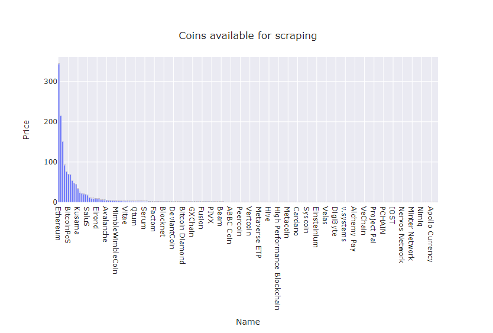

* Coins names:

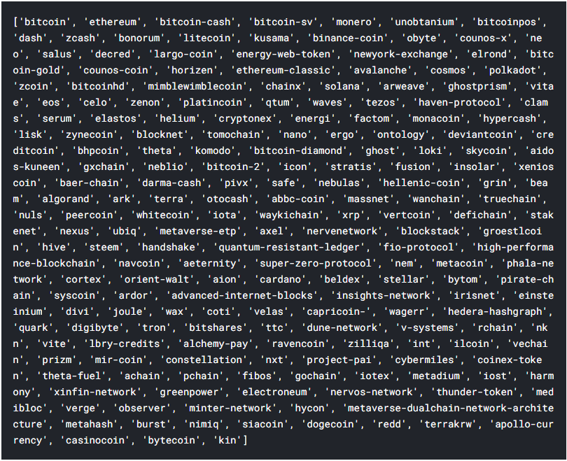

* Ethereum high price graph since first source records:

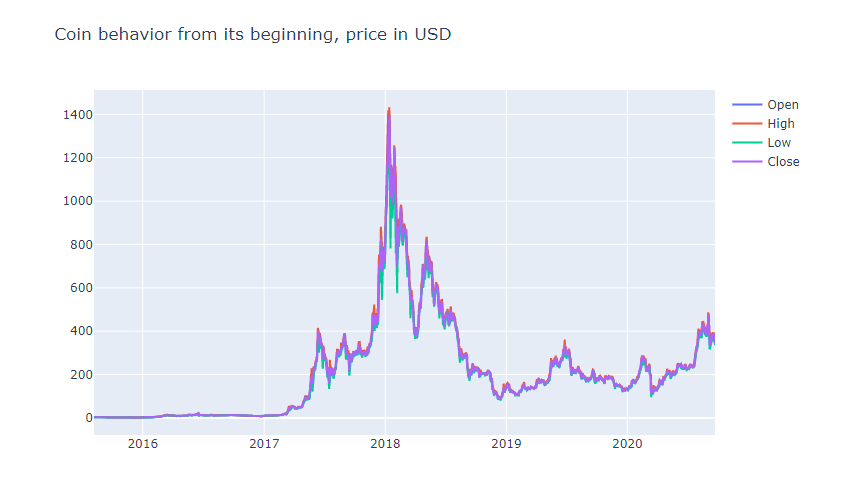
    
    2.- Also It's possible to get data by hours or days from https://www.cryptodatadownload.com/data/ but only till each Monday of each week.

--------------------------------------------------------------------------------------------------------------------------------------------------------------------------------------------------------------------------------

# Stage 2 Time series forecasting

## First model Prophet 

For more information: https://facebook.github.io/prophet/docs/quick_start.html#python-api

Prophet is a procedure for forecasting time series data based on an additive model where non-linear trends are fit with yearly, weekly, and daily seasonality, plus holiday effects. It works best with time series that have strong seasonal (cryptocurrencies are not seasonal) effects and several seasons of historical data.

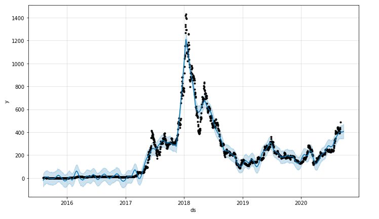

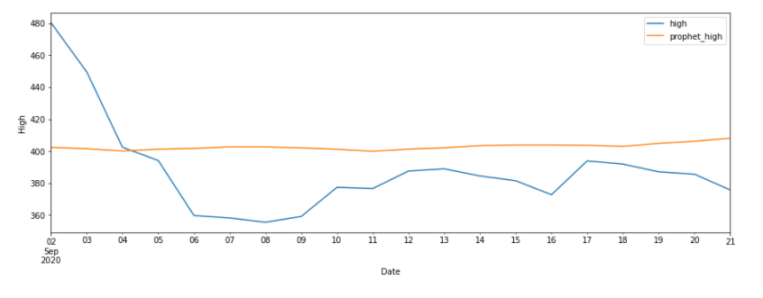

## Second model Arima (Autoregressive integrated moving average)

For more info about the model: https://www.machinelearningplus.com/time-series/arima-model-time-series-forecasting-python/

In this case (dealing with ETH) it's predictions do not fit changes as close as other models.

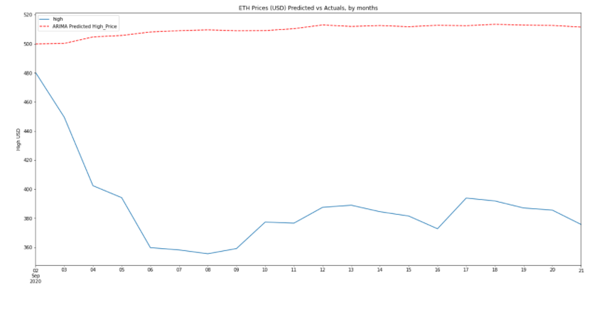

## Third model XGBoost (Extreme Gradient Boosting)

For more info about the model: https://xgboost.readthedocs.io/en/latest/tutorials/model.html

Good performance and fast training time.

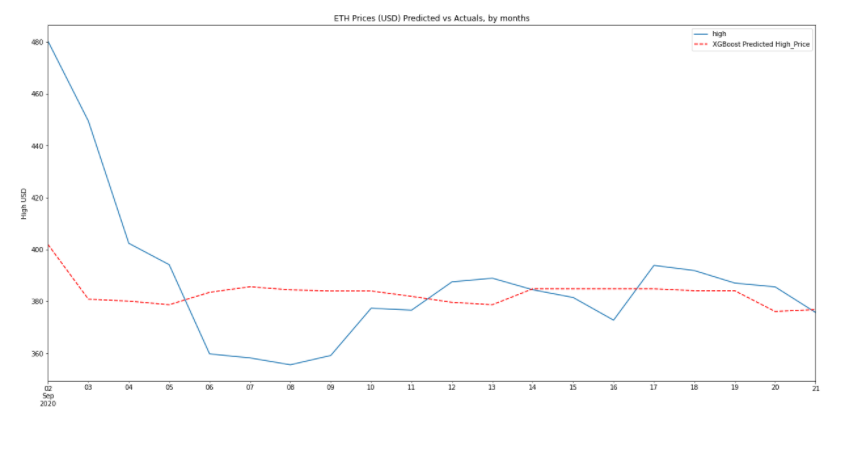

## Fourth model Pycaret 

For more info about this tool: https://pycaret.org/regression/

In this case is used the function Blend Models: This function creates an ensemble meta-estimator that fits a base regressor on the whole dataset. It then averages the predictions to form a final prediction.

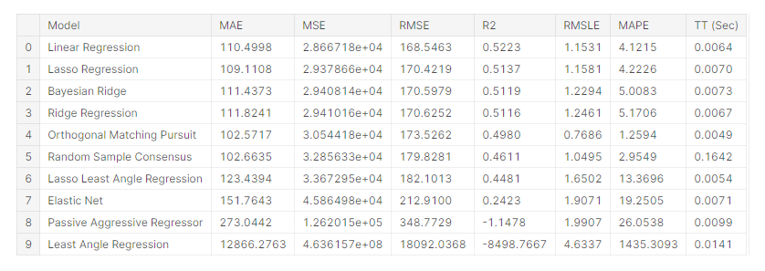

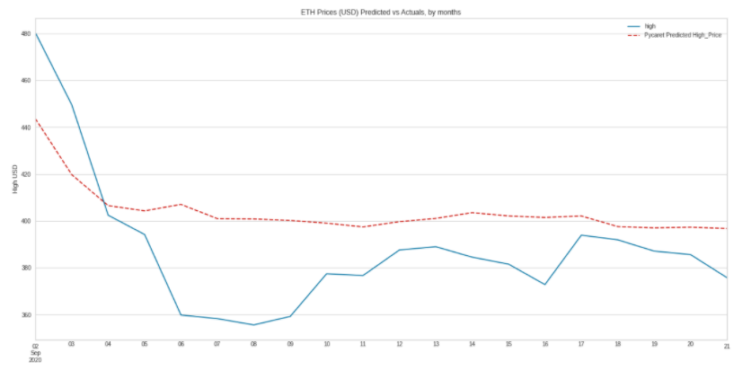

## Fifth model RNN - LSTM (Long Short Term Memory) 

Some information to understand RNN's https://colah.github.io/posts/2015-08-Understanding-LSTMs/

For forecastings I choose a window size of 20 data, It means that each prediction is done considering the 20 data before and all the weights that the neural network is saving.

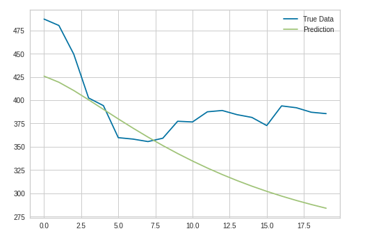

## Sixth model RNN - GRU (Gated Recurrent Units)

Same workflow as the model ↑ but different RNN model also included in the link provided ↑.

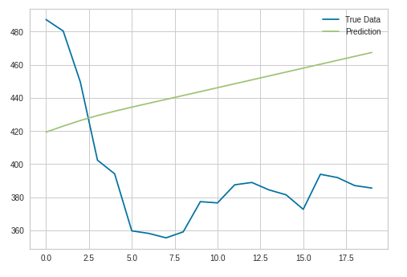

----------------------------------------------------------------------------------------------------------------------------------------------------------------------------------------------------------------------------

# Stage 3 Comparing forecastings

Data frame with last 20 days high price and forecasting from all models.

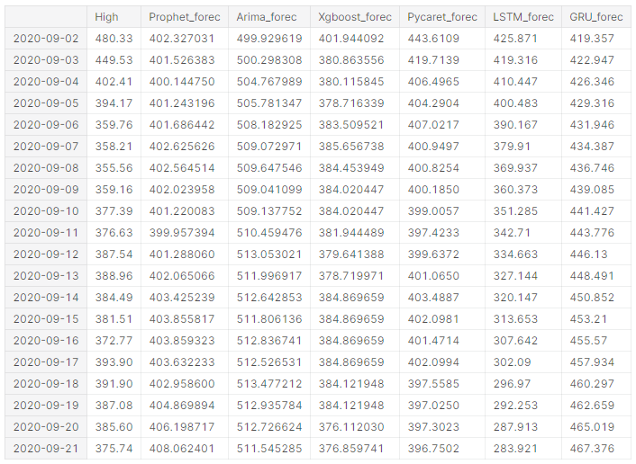

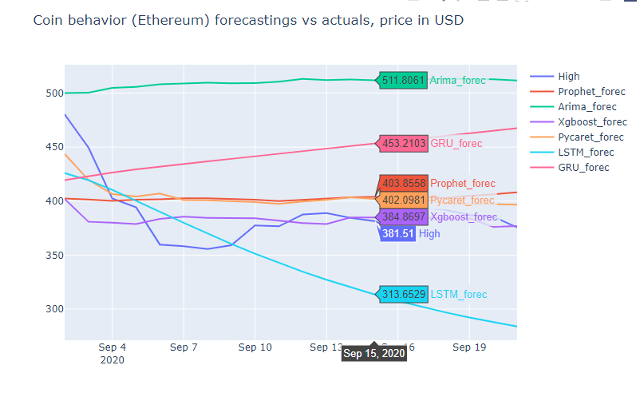

Finally all mse models is compared showing that pycaret performed the best forecasting followed by XGBoost model.

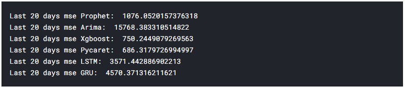

# Notes

Results are not always the same, sometimes one model perfoms better than other, for example when I started with first testings ARIMA forecastings fited closer to the real price, other issue in this case is that RNN's are not working as good as desired because the data is not enough to train them.

In next stages I will try forecasting with data by hour and windows of 24 data...

12 gb RAM is not enough to run Arima model