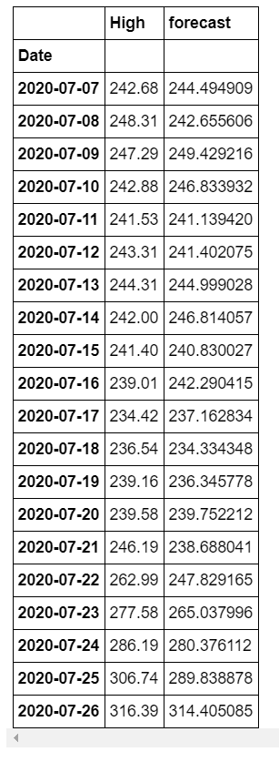
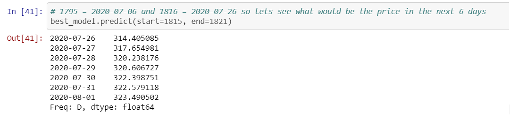

Working on it ...

By now the best model for ETH seems to be Arima, but for other cryptos like Swipe that is more 
volatile and has less data the accuracy and predictions turns very bad 24/07/2020

Example of Full_Analizer_Arima(Tuned)_ETH near date 26/07/2020.

After date 26/07/2020.

Best model is arima tuned for XMR, ETH and BTC with data by day but there are some issues with dates format.