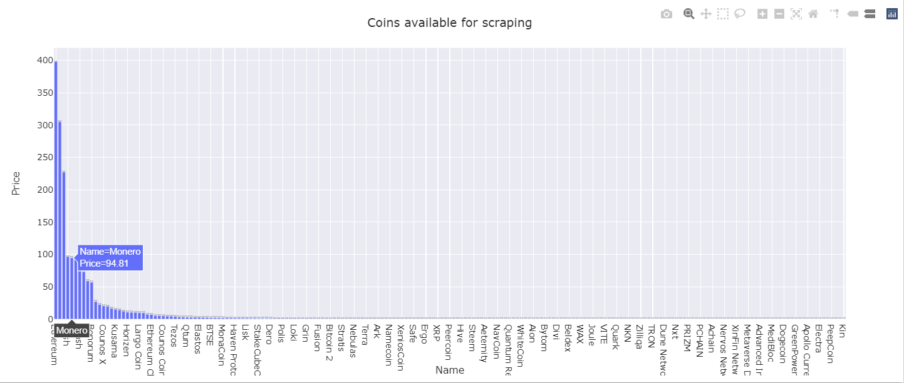
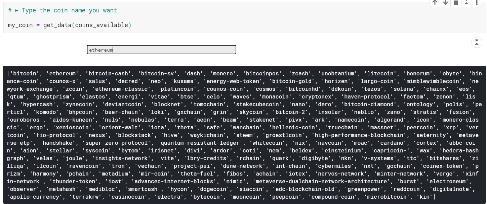
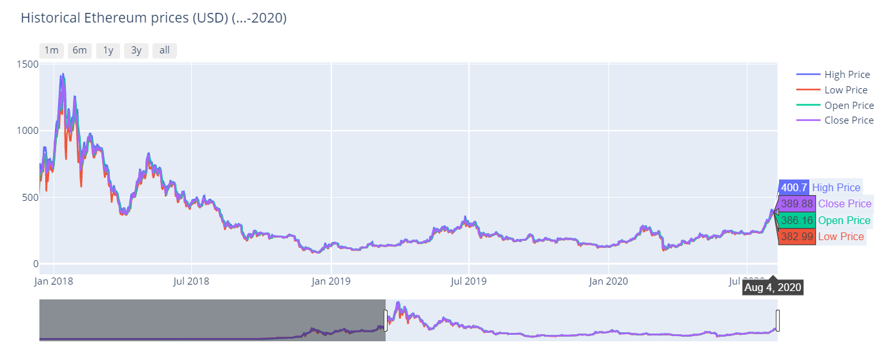
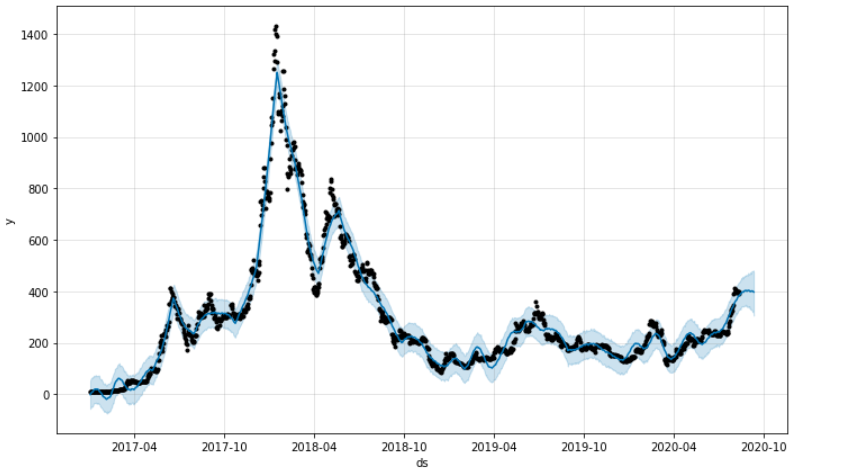
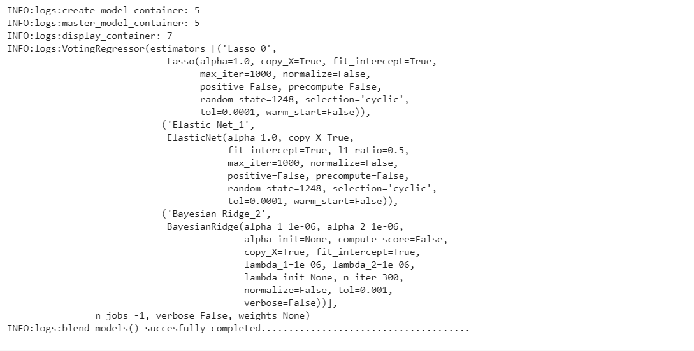
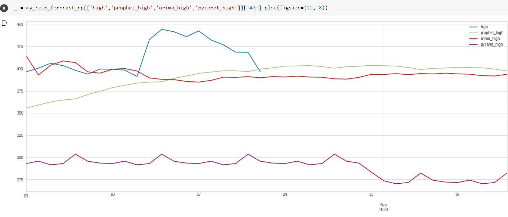

Working on it ...

# Stage 1 Data extraction

The methods I used to extract data

    1.- Scrapping data from: https://coinmarketcap.com/ 

Script at: https://www.kaggle.com/jinuezb/cryptocurrencies-daily-data
    
    2.- Also It's possible to get data by hours or days from https://www.cryptodatadownload.com/data/ but only till each Monday of each week.

--------------------------------------------------------------------------------------------------------------------------------------------------------------------------------------------------------------------------------

# Stage 2 Time series forecasting

## First attempt

Arima performed best predictions but I will keep trying with different models and hyperparamenters

## Second attempt 

* Prophet: hyperparameter changepoint_prior_scale=1.1 - best MSE

* XGBoost: Working on it.

* Arima: 

* Pycaret blender 3 models:

* LSTM: Working on it

Comparing again PyCaret, FbProphet and ARIMA for ETH forecasting (Last 40 days)

* GRU: Working on it.

